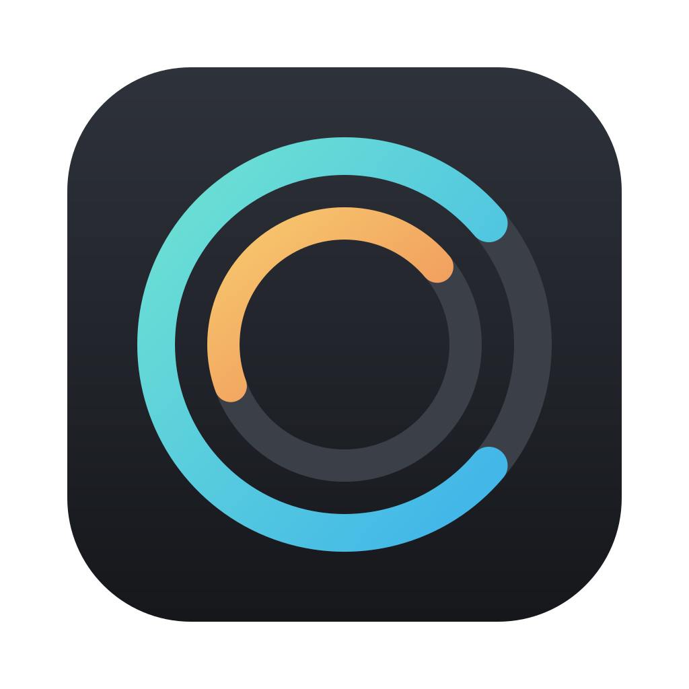
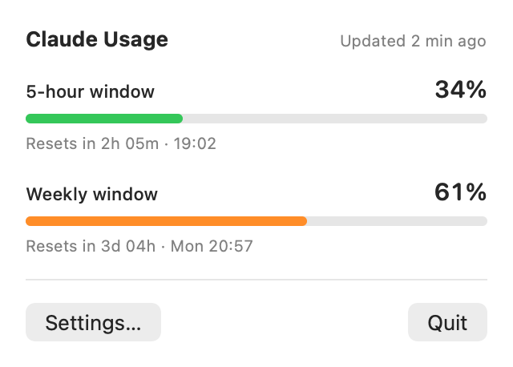
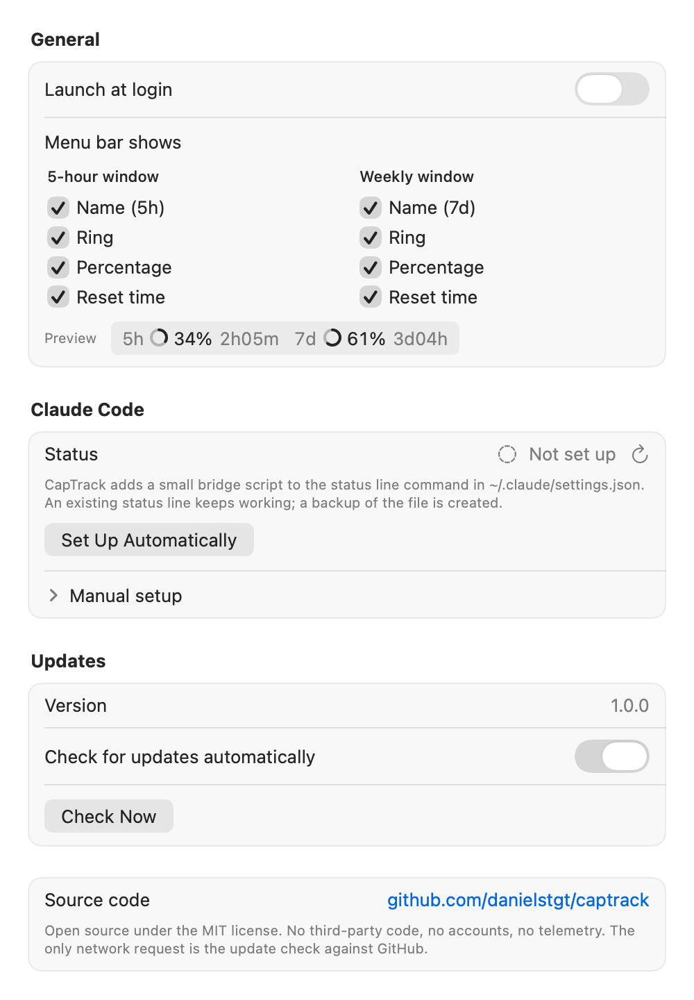

<p align="center">
  
</p>

<h1 align="center">CapTrack</h1>

<p align="center">
  Your Claude usage limits, right in the macOS menu bar.<br>
  5-hour window · weekly window · reset times
</p>

<p align="center">
  <picture>
    <source media="(prefers-color-scheme: dark)" srcset="Assets/menubar-dark.png">
    
  </picture>
</p>

<p align="center">
  <picture>
    <source media="(prefers-color-scheme: dark)" srcset="Assets/preview-dark.png">
    
  </picture>
</p>

CapTrack is a tiny native macOS app that shows how much of your Claude Pro/Max
usage you have consumed and when each window resets. It gets its numbers from
[Claude Code](https://code.claude.com), exactly the way Claude Code's own status line
does, so it never talks to Anthropic's API and never touches your credentials.

- **Menu bar at a glance:** `5h ◔ 34% 2h05m  7d ◑ 61% 3d04h`. One ring per window that fills with usage, the percentage, and the countdown to the reset.
- **Details on click:** both windows with progress bars, reset countdowns and the exact reset time.
- **Zero dependencies:** Swift, AppKit and SwiftUI only. No packages, no frameworks, no update engine, no analytics. Nothing to supply-chain.
- **Local by design:** reads one JSON file that Claude Code writes on your Mac. The only network request is the optional update check against GitHub.
- **Small:** one binary, about a thousand lines of Swift, MIT licensed.

## How it works

Claude Code passes a JSON document to every configured
[status line](https://code.claude.com/docs/en/statusline) command. For Pro and Max
accounts that document contains a `rate_limits` object with the 5-hour and 7-day
windows, their `used_percentage` and the `resets_at` timestamp. That is an official,
documented feature.

CapTrack installs a 20-line shell script, `~/.local/bin/captrack-statusline`, and
puts it in front of your status line command:

```
Claude Code ──JSON──▶ captrack-statusline ──JSON──▶ your existing status line (optional)
                              │
                              ▼
        ~/Library/Application Support/CapTrack/statusline.json ──▶ CapTrack.app
```

The script stores a copy of the JSON and hands it on unchanged. CapTrack watches
that file and re-renders the menu bar whenever it changes. Reset countdowns tick
locally, so the display stays useful between updates.

What CapTrack deliberately does **not** do:

- No calls to Anthropic's API and no use of OAuth tokens or the Keychain.
  Reading a subscription's usage through the Claude Code credentials from a
  third-party app is not something Anthropic sanctions, so CapTrack does not do it.
- No background daemons, launch agents or helper processes. The bridge only runs
  when Claude Code renders its status line.
- No telemetry, crash reporting or accounts.

Because the data comes from Claude Code, it updates while a Claude Code session is
running. When Claude Code is idle the popover shows when the last update arrived, and
once a window's reset time passes CapTrack shows 0% until the next message.

## Requirements

- macOS 14 Sonoma or newer (Apple silicon and Intel)
- Claude Code signed in with a Claude Pro or Max subscription. API-key sessions do not
  report rate limits.

## Install

**Download:** grab `CapTrack-<version>.zip` from the
[latest release](https://github.com/danielstgt/captrack/releases/latest), unzip it and
move `CapTrack.app` to your Applications folder.

The releases are built by GitHub Actions from the tagged source and are ad-hoc
signed, not notarised. On first launch macOS will refuse to open it; right-click the
app, choose **Open**, and confirm. Alternatively:

```sh
xattr -d com.apple.quarantine /Applications/CapTrack.app
```

**Or build it yourself** (Xcode 26 or the matching command line tools):

```sh
git clone https://github.com/danielstgt/captrack.git
cd captrack
make install        # builds build/CapTrack.app and copies it to /Applications
```

## Connect Claude Code

1. Launch CapTrack and click the ring in the menu bar.
2. Choose **Settings…** and, under *Claude Code*, click **Set Up Automatically**.

CapTrack adds the bridge to `statusLine.command` in `~/.claude/settings.json`. An
existing status line keeps working, and a timestamped backup of the file is written
next to it. Usage appears after the next response in a Claude Code session.

Prefer to edit the file yourself? Use this, keeping your current command as the
argument:

```json
"statusLine": {
  "type": "command",
  "command": "~/.local/bin/captrack-statusline 'python3 ~/.claude/statusline.py'"
}
```

Without an existing status line, the command is just `~/.local/bin/captrack-statusline`.

## Settings

<p align="center">
  <picture>
    <source media="(prefers-color-scheme: dark)" srcset="Assets/settings-dark.png">
    
  </picture>
</p>

- **Launch at login** registers CapTrack as a login item through `SMAppService`, the
  standard macOS mechanism. Nothing is written to `~/Library/LaunchAgents`.
- **Menu bar shows** has a checkbox per element and window: name, ring, percentage and reset countdown for the 5-hour and the weekly window, with a live preview of the result.
- **Check for updates** asks the GitHub Releases API whether a newer version exists,
  once a day when enabled or whenever you click *Check Now*. CapTrack never downloads or
  installs anything itself; it opens the release in your browser and you replace the app.

Right-clicking the menu bar ring shows the same actions as a menu.

## Build from source

```sh
make            # build/CapTrack.app, universal binary, ad-hoc signed
make run        # build and launch
make test       # unit tests (swift test)
make zip        # build/CapTrack-<version>.zip
make preview    # re-render the screenshots in Assets/
make og-image   # social preview for GitHub, see Art/
```

You can also open `Package.swift` in Xcode. Everything is plain Swift Package
Manager; the Makefile only assembles the `.app` bundle, generates the icon from
`Assets/logo.svg` and signs it. Pass `SIGN_IDENTITY="Developer ID Application: …"`
to sign with your own certificate.

Releases are cut by pushing a tag: `git tag v1.2.0 && git push origin v1.2.0`. The
workflow in `.github/workflows/release.yml` builds the app on a macOS runner and
attaches the zip to a GitHub release. It uses no marketplace actions.

`./Art/generate-og-image.swift` draws the social preview image (`Art/og-image.jpg`,
2560×1280) that GitHub shows when the repository is shared. It runs like a shell
script but is written in Swift, because rendering text and vector graphics without
third-party tools needs AppKit. Upload the result under *Settings › General › Social preview*.

### Layout

```
Sources/CapTrack/
├── main.swift                 entry point
├── AppDelegate.swift          status item, popover, settings window, menus
├── StatusItemIcon.swift       the menu bar ring
├── Models/UsageSnapshot.swift parses Claude Code's status line JSON
├── Services/
│   ├── UsageStore.swift            watches the JSON file
│   ├── ClaudeCodeIntegration.swift bridge script + settings.json setup
│   ├── LaunchAtLogin.swift         SMAppService wrapper
│   ├── UpdateChecker.swift         GitHub Releases lookup
│   └── Preferences.swift           UserDefaults
├── Views/                     SwiftUI popover and settings
└── Support/                   formatting, app info, README renderer
Tests/CapTrackTests/           swift-testing unit tests
Art/                           social preview image and its generator
Assets/                        logo and README screenshots
Scripts/                       app icon generator
```

## Uninstall

1. Quit CapTrack and delete `CapTrack.app`.
2. Remove the bridge from `statusLine.command` in `~/.claude/settings.json` (or restore
   the `settings.json.captrack-backup-…` file next to it).
3. Delete `~/.local/bin/captrack-statusline` and `~/Library/Application Support/CapTrack`.

## FAQ

**The menu bar only shows the ring, no numbers.**
No data has arrived yet. Check *Settings › Claude Code* shows *Connected*, then send a
message in Claude Code. Rate limits are only reported after the first response of a
session, and only for Pro and Max subscriptions.

**Does it count usage from claude.ai or the desktop app?**
The percentages are account-wide, so yes. But CapTrack only receives fresh numbers
through Claude Code, so the display updates when Claude Code is active.

**Why not read the usage directly from Anthropic's API?**
That would require reusing Claude Code's OAuth token outside Claude Code, which
Anthropic does not permit for third-party tools. The status line route is documented,
supported, and keeps everything on your machine.

**Is `statusline.json` sensitive?**
It is the same JSON Claude Code gives any status line script: model name, working
directory, session id, context and cost figures, and the rate limits. It stays in your
user library and is never sent anywhere.

## License

[MIT](LICENSE). CapTrack is an independent open source project and is not affiliated
with or endorsed by Anthropic. Claude is a trademark of Anthropic, PBC.
